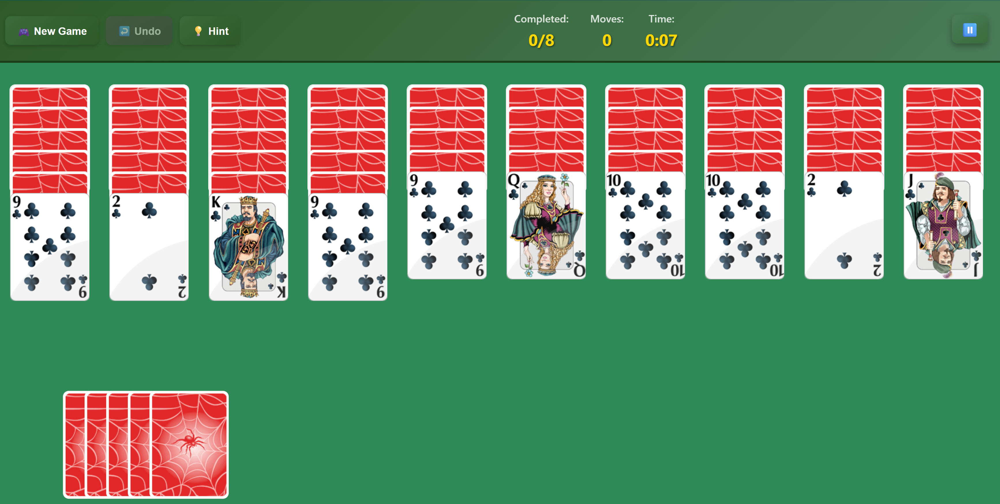

# 🕷️ Spider Solitaire Game

A modern, production-ready Spider Solitaire game built with React, TypeScript, Vite, and Tailwind CSS. Enjoy classic gameplay with undo, hints, timer, celebration effects, and full mobile support. Easily deployable with Docker and optimized for performance.



## 🚀 Features

- **🎮 Full Game Experience**: Classic Spider Solitaire rules
- **⏱️ Timer**: Track your play time
- **↩️ Undo**: Revert your moves
- **💡 Hint**: Get helpful hints
- **🎉 Celebration**: Special animation when you win
- **📱 Responsive**: Works on mobile and desktop
- **🎨 Modern UI**: Beautiful, user-friendly interface
- **🔧 TypeScript**: Full type safety
- **🐳 Docker**: Containerization support

## 🛠️ Technologies

- **React 18** – Modern UI framework
- **TypeScript** – Type safety
- **Vite** – Fast build tool
- **Tailwind CSS** – Utility-first CSS
- **React Router** – Client-side routing
- **SweetAlert2** – Beautiful popups
- **Docker** – Containerization
- **Nginx** – Production web server

## 📦 Installation

### Development

```bash
# Clone the repository
git clone <repository-url>
cd ReactReverseSpiderSolitaire

# Install dependencies
npm install

# Start the development server
npm run dev
```

### Run with Docker

```bash
# Build the Docker image
docker build -t spider-solitaire .

# Run the container
docker run -d -p 3000:80 --name spider-solitaire-app spider-solitaire
```

### Run with Docker Compose

```bash
docker-compose up -d

# To stop
docker-compose down
```

## 🎯 Game Rules

1. **Goal**: Build 8 complete sets from King to Ace
2. **Move**: Arrange cards in descending order
3. **Selection**: Only face-up cards can be moved
4. **Set**: Completed 13-card sets are auto-removed
5. **Stock**: Use stock cards when stuck

## 📁 Project Structure

```text
src/
├── ui/         # React components
├── styles/     # CSS modules
├── utils/      # Game logic and helpers
├── types/      # TypeScript types
public/
└── assets/     # Card images and static files
```

## 🐳 Docker Details

- **Multi-stage build**: Node.js for build, Nginx for static serving
- **Optimizations**: Gzip compression, cache headers, security headers
- **Client-side routing**: React Router support

## 🚀 Production Deployment

- Push to Docker Hub, deploy with Kubernetes or any container platform.

## 🧪 Testing

The project includes comprehensive test coverage with Vitest and React Testing Library:

```bash
npm run test         # Run all tests
npm run test:watch   # Run tests in watch mode
npm run test:ui      # Run tests with UI interface
npm run test:coverage # Run tests with coverage report
```

### Test Structure

- **Unit Tests**: `src/utils/__tests__/` - Game logic and utility functions
- **Component Tests**: `src/ui/__tests__/` - React component testing
- **Integration Tests**: `src/test/integration.test.tsx` - End-to-end game flow
- **Test Setup**: `src/test/setup.ts` - Test environment configuration

### Test Coverage

- ✅ Game initialization and card distribution
- ✅ Card drag and drop functionality
- ✅ Timer and game state management
- ✅ Button interactions and user events
- ✅ Error handling and edge cases
- ✅ Performance and accessibility

## 🔧 Development Commands

```bash
npm run dev         # Start dev server
npm run build       # Production build
npm run preview     # Preview production build
npm run type-check  # TypeScript check
npm run lint        # Lint check
npm run test        # Run tests
npm run test:watch  # Run tests in watch mode
npm run test:ui     # Run tests with UI interface
npm run test:coverage # Run tests with coverage report
```

## 📊 Performance

- **Bundle Size**: ~500KB (gzipped)
- **Load Time**: <2s (3G)
- **Lighthouse Score**: 95+
- **Container Size**: ~50MB

---

**Enjoy the game!** 🕷️

---

> **Note:** The Hint and Undo features are currently not working and there may be some bugs. Please don't forget to provide feedback and report any issues you encounter!
